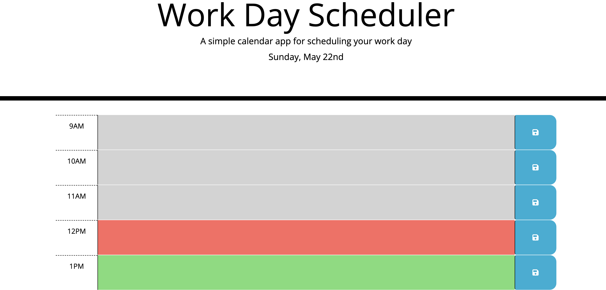
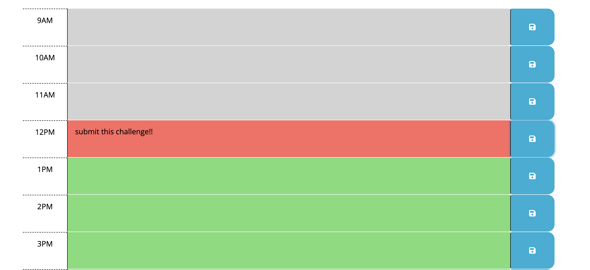

# work-day-scheduler
link: https://roo116.github.io/work-day-scheduler/
Github repo: https://github.com/roo116/work-day-scheduler

## user story

AS AN employee with a busy schedule I WANT to add important events to a daily planner SO THAT I can manage my time effectively.

## Instructions/Features

1. Displays current date. 

2. Displays Time blocks for text entry, and time blocks are color coded based on time of day relative to current time. 

3. And YES you can enter an event.  If you refresh the page, the event will remain. 

## acceptance criteria

GIVEN I am using a daily planner to create a schedule

1. WHEN I open the planner THEN the current day is displayed at the top of the calendar
2. WHEN I scroll down THEN I am presented with time blocks for standard business hours
3. WHEN I view the time blocks for that day THEN each time block is color-coded to indicate whether it is in the past, present, or future
4. WHEN I click into a time block THEN I can enter an event
5. WHEN I click the save button for that time block THEN the text for that event is saved in local storage
6. WHEN I refresh the page THEN the saved events persist
